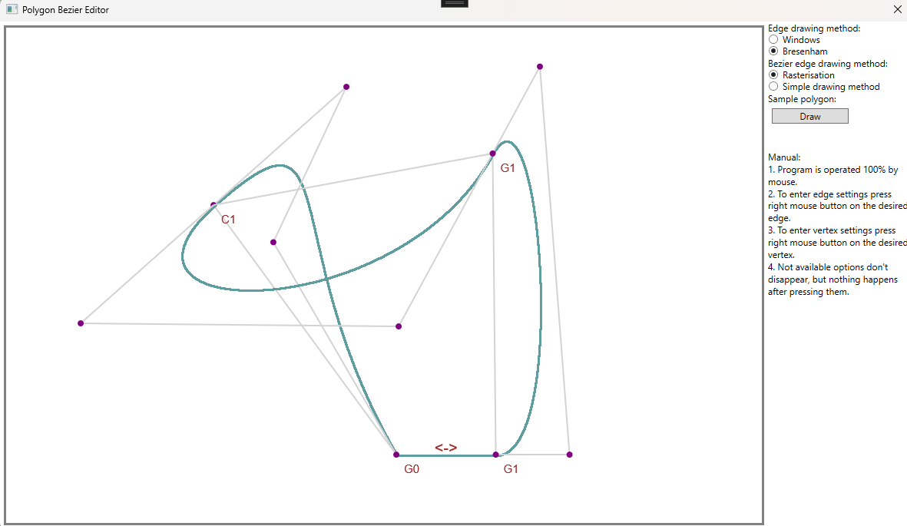

# 🎨 Polygon & Bézier Editor (WPF)

A desktop application written in **C# / WPF** that allows interactive drawing and editing of polygons and cubic Bézier curves.

## 🎓 Academic Context

Project was created as part of the academic course **Computer Graphics** during the **2024/2025 winter semester** at **Warsaw University of Technology**.

## ✨ Features

- 🖱️ **Polygon creation**
  - Draw a polygon manually by clicking with the mouse to place vertices.
  - Or use the **Draw** button to generate a predefined sample polygon.

- **Line drawing algorithms**
  - Standard WPF method using `dc.DrawLine(pen, p1, p2)`.
  - Custom implementation of **Bresenham's line algorithm**.

- ➰ **Bézier curve drawing (cubic only)**
  - Direct evaluation: points of the curve are calculated and plotted pixel by pixel.
  - Advanced **rasterization algorithm** (by [Alois Zingl](https://zingl.github.io/Bresenham.pdf)), which produces smoother curves, but is more complex.

- ✂️ **Edge editing (right-click on an edge)**
  1. ➕ Add a new vertex on the edge.
  2. ↔️ Set edge as **horizontal**.
  3. ↕️ Set edge as **vertical**.
  4. 📏 Set edge to a **fixed length** (value provided in a popup).
  5. ➰ Convert edge to a **cubic Bézier curve**.
  6. ♻️ Remove all constraints applied to the edge.

- 🔧 **Vertex editing (right-click on a vertex)**
  1. ❌ Delete the vertex.
  2. 🔗 If adjacent to a Bézier curve, set continuity type: **G0, G1, or C1**.
  3. ⚠️ Deleting vertices until only 2 remain removes the entire polygon.

- 🚚 **Polygon movement**
  - Drag the polygon by clicking inside its area and moving it across the canvas.
  - Move a **single vertex** by left-clicking and dragging it.  
  - Move a **whole edge** by left-clicking and dragging it.

## 🎮 Controls

- 🖱️ **Left mouse button** – add vertices when drawing a polygon.
- 🖱️ **Right mouse button on edge** – open edge options.
- 🖱️ **Right mouse button on vertex** – open vertex options.
- ✋ **Drag inside polygon** – move the polygon.
- ✋ **Drag an edge** – move the edge (if possible).
- ✋ **Drag a vertex** – move the vertex (if possible). 

## 🛠️ Technologies

- **C# / WPF**
- Custom graphics algorithms (Bresenham, Bézier rasterization)

## 🖼️ Preview

## 👤 Author

Developed by [Piotr Iśtok](https://github.com/p10tr13).

## 📜 License

This project is released under the MIT License.
